# XAI Workstation

> **"XAI on the wall, who is the explainer of them all?"**

Neural networks are powerful but often function as "black boxes," making it difficult to trust their decisions. This project operates within the field of Explainable AI (XAI). Its core purpose is to evaluate state-of-the-art post-hoc explainers, focusing specifically on their ability to generate understandable and trustworthy rule-based explanations for neural network predictions.

XAI Workstation is a comprehensive Graphical User Interface designed to democratize access to Explainable Artificial Intelligence (XAI). It allows users to load data, design and train neural networks without coding, and most importantly, explain their predictions using state-of-the-art algorithms like DEXiRE and CIU (Local Contextual Importance).

## Technical Implementation
The project involves building a fully automated Python-based pipeline. The workflow consists of three main stages:
  * **Training**: Training an MLP classifier on a structured dataset.
  * **Extraction**: Integrating and running the three explainers (DEXiRE, DEXiRE-EA, CIU) on the trained model.
  * **Evaluation**: Automating the assessment of these explanations using specific metrics.

## Highlights
  * **Data Flexibility**: Native support for classic datasets (Iris, Wine, Breast Cancer) and custom CSV file import.
  * **No-Code Architecture**: Design your neural network layer by layer via a visual interface.
  * **Advanced Explainability**:
      * **Global**: Extract human-readable rules with DEXiRE and DEXiRE EVO.
      * **Local**: Understand individual decisions using CIU plots.
  * **Experiment Management**: Save your models, configurations, and results. Reload them later or overwrite them if you improve performance.

## DeXIRE
DEXiRE (Decompositional Rule Extractor) is a decompositional rule extractor employed as a post-hoc Explainable AI (XAI) technique. Its primary goal is to make data-driven classifiers, such as deep learning (DL) predictors, more transparent. By extracting rule sets, DEXiRE facilitates researchers' and clinicians' understanding of the model's internal decision process, especially in critical safety domains like medical diagnosis.

### Functioning:
DEXiRE is applied to a pre-trained DL predictor. As a decompositional method, it works by looking inside the predictor’s structure. It extracts logical rules by binarizing network activations and then inducing logical rules using these binary activations. These inducted rules are then recombined and expressed in terms of the input features. This process generates symbolic, logical rule sets that reflect the DL predictor's internal behavior.

## DEXiRE EVO

DEXiRE EVO is defined as a post-hoc rule extraction engine for XAI applied to neural networks. Its purpose is to evolve an interpretable, symbolic ruleset that accurately approximates the predictive behavior of the original black-box model.

### Functioning:
DEXiRE EVO utilizes multi-objective genetic algorithms (NSGA-II) for optimization.
*   **Ruleset Structure:** Each ruleset (individual) is an ordered list of IF–THEN rules, where the prediction follows a first-match logic.
*   **Optimization:** The NSGA-II algorithm balances multiple concurrent objectives: fidelity (similarity to the original neural network’s predictions), ruleset complexity (number of predicates), and data coverage (minimizing uncovered samples).
*   **Evolutionary Process:** The process involves generating a random population, using a two-point crossover to exchange contiguous rule subsets, and applying mutation (which can add/remove rules or modify predicate components).

## CIU

CIU (Contextual Importance and Utility) is an explainable machine learning method used for local post-hoc explanations. Its purpose is to explain the prediction of a black-box model specifically for a given data point.

### Functioning:
CIU uses concepts derived from decision theory. It investigates the importance and usefulness of individual features, or combinations of features, concerning that specific prediction. The resulting explanations are aimed at being intelligible to both machine learning experts and non-technical users.


## Quick Start

```bash
# 1. Clone the repository
git clone https://github.com/HEI-courses/303.1_2025_DEXiRE_DEXIRE_EVO_CIU_Pipeline_and_GUI
cd 303.1_2025_DEXiRE_DEXIRE_EVO_CIU_Pipeline_and_GUI

# 2. Install dependencies
uv sync

# 3. Launch the application
uv run main.py

# 4. If you want to log the training in Weights & Biases, you’ll need to get your API key and enter it in the terminal when asked
```

# User Guide

This guide explains how to install, use, and troubleshoot the XAI Workstation application.

## Installation

### Prerequisites

  * Python 3.12 or higher.
  * [uv](https://github.com/astral-sh/uv).

### Dependencies installation

The project uses `uv` for fast and reliable package management.

```bash
uv sync
```

## Usage

To launch the interface, run:

```bash
python main.py
# or with uv
uv run main.py
```

Then open the local URL displayed in your terminal (usually `http://127.0.0.1:7860`).

### 1\. Dataset Tab

  * **Source**: Choose between "Sklearn" (built-in datasets) or "CSV File" (your own data).

  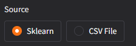

  * **Loading**: Select the dataset or upload your file, then click **"Load Data"**.
  * **Visualization**: A class distribution pie chart will appear to confirm loading.

  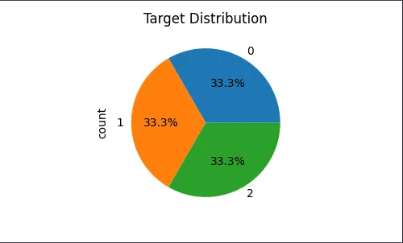

### 2\. Model Tab

  * **Architecture Designer**:
      * Add layers with **"Add Layer"**.
      * Modify the number of units and activation function for each layer.
      * Delete layers if necessary.

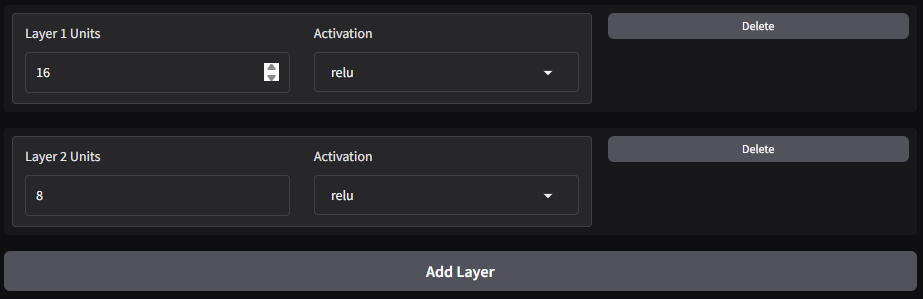

  * **Training Parameters**: Set Epochs, Learning Rate, Seed, Optimizer, and Loss Function.

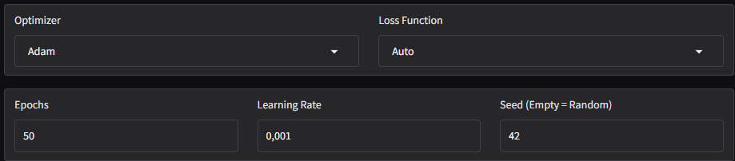

  * **Training**: Click **"Train Model"**. Loss and Accuracy curves will be updated at the end of the train. You have also an architecture schema of the model that you created with all layers.

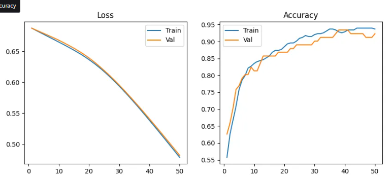

### 3\. Explainer Tab (XAI)

Once the model is trained:

  * **DEXiRE**: Click "Calculate Global Rules" to generate "If... Then..." rules that explain the model's global behavior.

  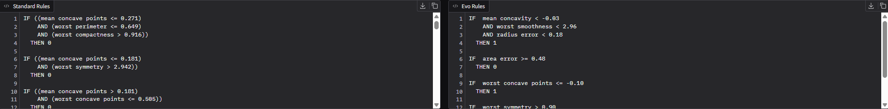

  * **Evaluation Metrics**: Review the "DEXiRE Summary Statistics" panel to assess the quality of the rules (Number of rules, Features count, Fidelity/Accuracy).

  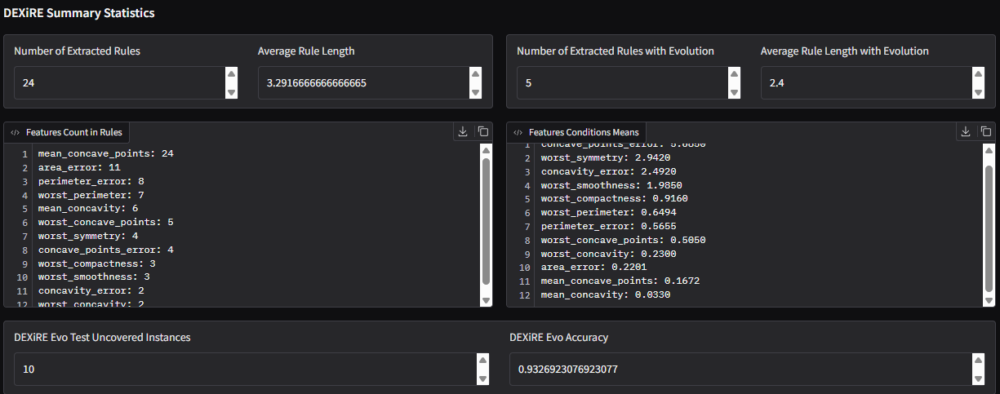

  * **CIU**: Enter the index of a data instance (row in the dataset) and click **"Explain Instance"** to see why the model made that specific decision.

  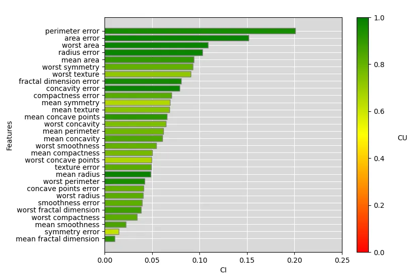


### Save Management 

  * **Save New**: Saves the current configuration (Data + Model + Results) under a new name. 

  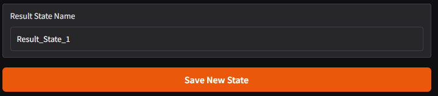

  * **Load**: Loads a past experiment from the dropdown menu.

  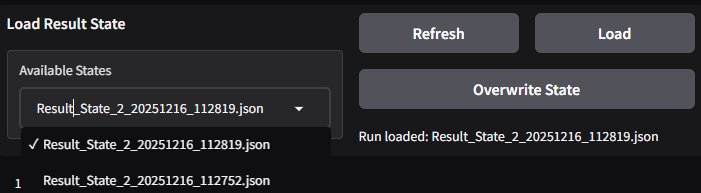

  * **Overwrite**: Overwrites the selected save with the current state.

  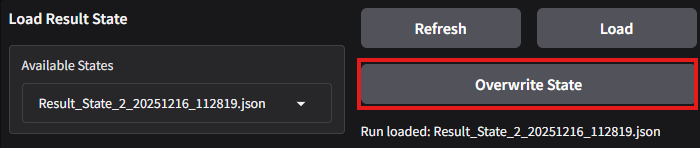

## Troubleshooting

| Issue | Possible Cause | Solution |
| :--- | :--- | :--- |
| **"Error: You changed the model architecture..."** | You are trying to overwrite a save after modifying layers without retraining. | Click **"Train Model"** to update the model, then try "Overwrite" again. Or reload the save(you will loose your changes) |
-----

# Developer Guide

This section is intended for developers who want to understand or modify the source code.

## Workflow schema


-----


Design mockup created with Figma using shadcn/ui components and photos from Unsplash.


## Code Structure

```text
xai-on-the-wall/
├── pyproject.toml           # Dependency management.
├── uv.lock                  # Exact version lock file.
├── saves/                   # Generated folder containing save file: model (.pth), configs (.json), images and data.
├── src/
│   ├── config.py            # Config file with default value for training and function to load config.yaml infos.
│   ├── load_data.py         # Dataset load (Sklearn demo data or csv files).
│   ├── model_builder.py     # Dynamic nn.Sequential construction from dataset config.
│   ├── model_adapter.py     # Adapter to have a prediction function.
│   ├── train.py             # PyTorch training loop.
│   └── preprocess.py        # Data preprocessing.
├── explainer/
│   ├── dexire.py            # Wrapper to use the DEXiRE library.
│   ├── dexire_evo/          # Wrapper to use the DEXiRE evo library.
│   └── ciu.py               # Wrapper to use the py-ciu library.
├── gradio_ui/
│   ├── logic.py             # UI formatting functions.
│   └── save_manager.py      # Logic to Save/Load/Overwrite runs.
└── tests/                   # Unit tests (pytest).

```

## Running Tests

Unit tests are located in the `tests/` folder and use `pytest`. They cover data loading, model building, and explainer integration.

To run the test suite:

```bash
# With uv
uv run pytest tests/

# Or directly if pytest is installed
pytest tests/
```
# Result

This section presents the performance of the MLP model trained on the **Wisconsin Breast Cancer** dataset, followed by an evaluation of the explanations provided by the DEXiRE and CIU algorithms.

## Model Performance 
We trained a Multi-Layer Perceptron using the following configuration via the Model Architecture Designer:

* **Architecture:** Input (30 features) -> Hidden 1 (16 units, ReLU) -> Hidden 2 (8 units, ReLU) -> Output (2 classes).
* **Hyperparameters:** 50 Epochs, Learning Rate of 0.001, Adam Optimizer.

**Training Dynamics:**
As shown in the curves below, the model converges rapidly. The Loss curve decreases steadily without significant signs of **overfitting** (the validation loss tracks the training loss closely).

* **Final Test Accuracy:** 92.3%
* **Final Loss:** 0.48

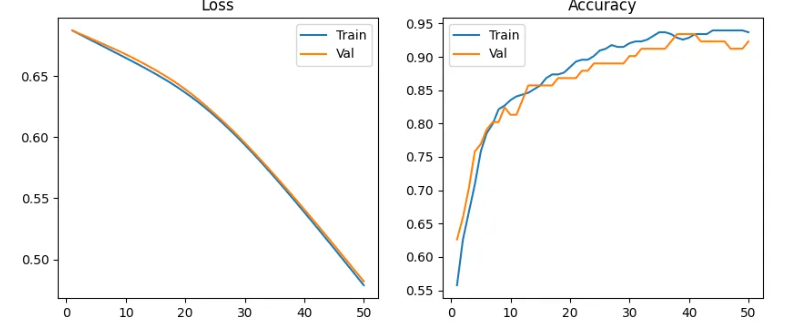

## Global Explanations: DEXiRE vs. DEXiRE-EVO
The objective was to extract human-readable "If... Then..." rules that imitate the MLP's behavior. We compared the standard approach (DEXiRE) against the evolutionary approach (DEXiRE-EVO).

### comparative 
Metrics Table| Metric | DEXiRE (Standard) | DEXiRE-EVO (Evolutionary) |
| --- | --- | --- |
| **Rule Count** | 24 | 5 |
| **Avg. Conditions per Rule** | 2.29 | 1.4 |

### Rule AnalysisThe 
**DEXiRE-EA** algorithm produced a more concise rule set (5 rules vs. 24) while maintaining higher fidelity (93%). This suggests that the genetic optimization successfully removed redundant rules, improving "comprehensibility" without sacrificing fidelity.

Below is examples of a high-confidence rules extracted by DEXiRE-EVO :

> **IF**  `mean concavity` < -0.03 **AND** `worst smoothness` < 2.96 **AND** `radius error` < 0.18 = **benign**

> **IF**  `area error` >= 0.48 **THEN** = **Malignant**

> **IF**  `worst symmetry` > 0.90 **THEN** = **Malignant**

> **IF**  `mean area` >= 0.83 **THEN** = **Malignant**


## Local Explanation: CIU Analysis
To understand the model's behavior at a granular level, we analyzed **Instance #0**.
**CIU Results:**
The CIU (Contextual Importance and Utility) analysis reveals which attributes influenced this specific decision:

1. **Perimerter error:** This was the determining factor for this patient.
2. **Mean Smoothness:** For this specific patient, cell regularity had very little impact on the final decision.

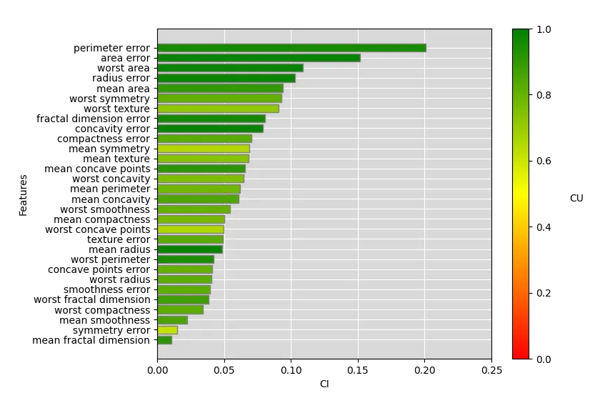

## Conclusion
The proposed pipeline demonstrates that high transparency can be achieved without sacrificing performance. The MLP model reached 94.5% accuracy, and the DEXiRE-EVO extractor successfully "translated" this performance into 5 simple rules with 94% fidelity. This offers an excellent trade-off between performance and interpretability.

# Sources
## Scientific Literature

The implementation of the explainers in this project is based on the following academic research:

* **DEXiRE / DEXiRE EVO**:
    * Contreras, V., Salazar, D., Torres, M. M., & Mery, D. (2022). *"A DEXIRE for extracting propositional rules from neural networks via binarization."* Electronics. [Read the paper](https://www.mdpi.com/2079-9292/11/24/4171).
    * Research from the HES-SO Valais-Wallis (HEVS). [View Publication](https://publications.hevs.ch/index.php/publications/show/3018).

* **CIU (Contextual Importance and Utility)**:
    * Anjomshoae, S., Kampik, T., & Främling, K. (2020). *"Py-CIU: a python library for explaining machine learning predictions using contextual importance and utility."* [Read the paper](https://www.diva-portal.org/smash/record.jsf?pid=diva2:1464596&dswid=4715).

## Frameworks & Tools

* **[Gradio](https://www.gradio.app/)**: Used to build the interactive web interface.
* **[Weights & Biases](https://wandb.ai/site/)**: Used for experiment tracking and loss/accuracy visualization.

## AI Assistance

* **ChatGPT**: Used for writing assistance, documentation structure, and generating the project banners and the base of the interface.
